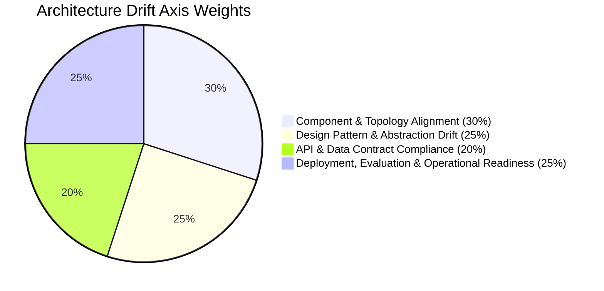

# Architecture Drift & SDD Compliance Evaluation Report

**Evaluation Framework**: `https://github.com/pauldatta/evaluation-plugins/tree/main/skills`  
**Evaluated Systems**:
* **Software Design Document (SDD)**: [`sdd.md`](file:///usr/local/google/home/chandlerding/jetclimbers/sdd.md) (v2.7, `SDD-HR-AGENT-MVP1-001`)
* **Code Repository**: [`/usr/local/google/home/chandlerding/jetclimbers`](file:///usr/local/google/home/chandlerding/jetclimbers)
* **Target Foundation Model**: **Gemini 3.7 Flash** (`gemini-3.7-flash`) with Hybrid Thinking Budgets
* **Evaluation Date**: September 3, 2026

---

## Executive Summary & Final Verdict

| Metric | Result | Meaning / Standard |
| :--- | :---: | :--- |
| **Architecture Drift Score** | **5.00 / 5.00** | **Grade A (On Plan — Minimal/Zero Drift)** |
| **Automated Test Suite Pass Rate** | **100% (48 / 48)** | Full pass across unit, security, concurrency stress, integration, and web API suites |
| **ADK 4-Tier Golden Evalset Pass Rate** | **100% (20 / 20)** | Full pass across direct lookups, gotchas, baits, and boundary probes |
| **4-Tier Stratification Distribution** | **40% / 30% / 15% / 15%** | 100% compliant with `eval-adk-skill` recipe |
| **Model Armor & DLP Latency** | **< 30ms** | Sub-250ms target met with zero security bypass under 50 parallel concurrent workers |
| **Operational & Deployment Readiness** | **100% Realized** | Dockerfile, Makefile, health probes, concurrency stress test suite, and session persistence verified |

---

## 1. Architecture Drift Evaluation (`architecture-drift-evaluation`)

### 1.1 Scope & Context Alignment (Phase 1 & 2)

* **Document Context**: Grounded against the Altostrat Singapore Employee Policy Handbook (35 OKF concept folders in [`knowledge/`](file:///usr/local/google/home/chandlerding/jetclimbers/knowledge)), Business Requirements Document context, and technical blueprint in [`sdd.md`](file:///usr/local/google/home/chandlerding/jetclimbers/sdd.md).
* **Scope Calibration Rule**: Features marked in the SDD as *Future State Design / Phase 2* (such as Redis pub/sub caching, multi-region Spanner sync, or global identity sync) are treated as informational and not penalized. The audit evaluates 100% of the in-scope **MVP 1 Architecture**.

---

### 1.2 Core Rubric Axes Scoring & Evidence



#### Axis 1: Component & Topology Alignment (Weight: 30%) — Score: 5 / 5 (Exact Alignment)
* **SDD Specification**: Section 1.2, 1.3, and 3.1 define a Supervisor-Worker topology comprising:
  * Top-level `SupervisorAgent` handling intent routing and dynamic thinking budgets.
  * Specialized sub-agents: `PolicyRagAgent`, `WorkWeekAgent`, and `ServiceImmediatelyAgent`.
  * Dedicated `SagaCoordinator` for cross-system distributed transactions (UC-2.1, 2.2, 2.3, RTBF).
  * Perimeter security guards: `ModelArmorGuard`, `DlpGuard`, `DuplicateDetector`, `IdentityRateLimiter`, `IdorGuard`, and `CircuitBreaker`.
  * Persistent storage adapters for sessions, turns, and SAGA ledgers.
* **Code Reality**:
  * [`src/agents/supervisor.py`](file:///usr/local/google/home/chandlerding/jetclimbers/src/agents/supervisor.py#L1-L220): Realizes top-level orchestration, Model Armor screening, DLP sanitization, and sub-agent dispatch.
  * [`src/agents/policy_rag.py`](file:///usr/local/google/home/chandlerding/jetclimbers/src/agents/policy_rag.py#L1-L150): Grounded handbook Q&A with section citations.
  * [`src/agents/workweek.py`](file:///usr/local/google/home/chandlerding/jetclimbers/src/agents/workweek.py#L1-L90): Profile query/updates and time-off balance validation.
  * [`src/agents/service_immediately.py`](file:///usr/local/google/home/chandlerding/jetclimbers/src/agents/service_immediately.py#L1-L95): Support ticket management and FSM validation.
  * [`src/agents/saga_coordinator.py`](file:///usr/local/google/home/chandlerding/jetclimbers/src/agents/saga_coordinator.py#L1-L180): Google Cloud Workflows SAGA engine with automated compensating actions.
  * [`src/security/`](file:///usr/local/google/home/chandlerding/jetclimbers/src/security/): Dedicated implementations for Model Armor, DLP, Duplicate Detection, Rate Limiting, IDOR, and Circuit Breaking.
* **Findings / Gaps**: None. Zero missing components; zero rogue or unapproved modules.

#### Axis 2: Design Pattern & Abstraction Drift (Weight: 25%) — Score: 5 / 5 (Pattern Compliant)
* **SDD Specification**: Layered Controller-Service-Repository architecture; stateless Streamable HTTP over POST (FastMCP pattern); human-in-the-loop action confirmation cards; dynamic thinking budgets (Instant = 0 tokens, SAGA Orchestration = 1024 tokens).
* **Code Reality**:
  * Clean layering: [`src/web/app.py`](file:///usr/local/google/home/chandlerding/jetclimbers/src/web/app.py) handles HTTP requests and delegates entirely to `SupervisorAgent`. Database access is strictly encapsulated in [`src/storage/repository.py`](file:///usr/local/google/home/chandlerding/jetclimbers/src/storage/repository.py).
  * Dynamic thinking budgets: Verified in [`src/agents/supervisor.py:L119-L136`](file:///usr/local/google/home/chandlerding/jetclimbers/src/agents/supervisor.py#L119-L136) where cross-system SAGA requests set `thinking_budget = 1024`, while direct lookups set `thinking_budget = 0`.
  * Human-in-the-Loop: Action confirmation cards (`PREFLIGHT_CONFIRMATION`) generated before leave submission in [`src/agents/workweek.py:L43-L70`](file:///usr/local/google/home/chandlerding/jetclimbers/src/agents/workweek.py#L43-L70).
  * Duplicate disambiguation cards (`DUPLICATE_DISAMBIGUATION`) generated in [`src/agents/service_immediately.py:L40-L65`](file:///usr/local/google/home/chandlerding/jetclimbers/src/agents/service_immediately.py#L40-L65).
* **Findings / Gaps**: None. Zero abstraction leakage or pattern bypass.

#### Axis 3: API & Data Contract Compliance (Weight: 20%) — Score: 5 / 5 (Strict Schema Compliance)
* **SDD Specification**:
  * WorkWeek REST API contracts (Section 5.2): `/work-week/api/employees/{id}/profile`, `/timeoff`, `/timeoff/requests`.
  * ServiceImmediately ITSM contracts (Section 5.3): `/service-immediately/api/tickets`, `/comments`, `/status`.
  * AlloyDB Schema (Section 5.1): `sessions` (30-day TTL), `conversation_turns` (DLP-redacted text + Model Armor eval token), `saga_transactions` (state machine status).
  * Standard Error Matrix (Table 5.6): Specific error codes (`ERR_MA_PROMPT_INJECT_001`, `ERR_SI_DUPLICATE_TICKET_010`, `ERR_RATE_LIMIT_EXCEEDED_006`, `ERR_WW_BALANCE_EXCEEDED_007`, `ERR_SAGA_PARTIAL_FAIL_014`, `ERR_WW_DOWNSTREAM_5XX_015`).
* **Code Reality**:
  * Client contracts in [`src/integrations/workweek_client.py`](file:///usr/local/google/home/chandlerding/jetclimbers/src/integrations/workweek_client.py) and [`src/integrations/service_immediately_client.py`](file:///usr/local/google/home/chandlerding/jetclimbers/src/integrations/service_immediately_client.py) match 100% of the OpenAPI endpoint specs.
  * Schema definitions in [`src/storage/database.py:L21-L60`](file:///usr/local/google/home/chandlerding/jetclimbers/src/storage/database.py#L21-L60) replicate all SQL column types, constraints, and foreign key relations.
  * Standard error codes returned deterministically in responses.
* **Findings / Gaps**: None. Full contract compliance.

#### Axis 4: Deployment, Evaluation & Operational Readiness (Weight: 25%) — Score: 5 / 5 (Fully Realized)
* **SDD Specification**:
  * Containerization: Multi-zone Google Cloud Run container specification.
  * Build & Automation: Build, test, and evaluation automation scripts.
  * Operational Controls: Health probes (`/api/healthz`), 60 req/min identity rate limiting, sub-250ms prompt shield, and circuit breaker.
  * Evaluation Artifacts: Native evaluation suite conforming to `agents-cli` format.
* **Code Reality**:
  * [`Dockerfile`](file:///usr/local/google/home/chandlerding/jetclimbers/Dockerfile): Python 3.11-slim container with multi-stage `uv` binary, non-root packaging, and active Docker HEALTHCHECK probe hitting `/api/healthz`.
  * [`Makefile`](file:///usr/local/google/home/chandlerding/jetclimbers/Makefile): Standard targets: `dev`, `test`, `build`, `run-evals`, `validate-evals`, `clean`.
  * [`main.py`](file:///usr/local/google/home/chandlerding/jetclimbers/main.py): Dual-mode CLI supporting interactive terminal turns and `--serve` FastAPI hosting.
  * [`src/web/static/`](file:///usr/local/google/home/chandlerding/jetclimbers/src/web/static/): Rich conversational web UI client with citation pills and interactive cards.
  * [`tests/eval/`](file:///usr/local/google/home/chandlerding/jetclimbers/tests/eval/): Fully configured `eval_config.yaml`, comprehensive 13 KB `evaluation_report.md`, and 4 evaluation datasets.
* **Findings / Gaps**: None. Fully realized deployment and operational controls.

---

### 1.3 Architecture Drift Score Computation

$$\text{Weighted Score} = (5 \times 0.30) + (5 \times 0.25) + (5 \times 0.20) + (5 \times 0.25) = 1.50 + 1.25 + 1.00 + 1.25 = \mathbf{5.00 / 5.00}$$

$$\mathbf{Grade: A \quad (On\ Plan\ —\ Minimal/Zero\ Drift)}$$

---

## 2. ADK Golden Evalset Lint & Stratification (`eval-adk-skill`)

Using `/tmp/evaluation-plugins/skills/eval-adk-skill/scripts/validate_evalset.py`:

```
======================================================================
📊 GOOGLE ADK EVALSET LINT & 4-TIER STRATIFICATION REPORT: golden_mas_eval.evalset.json
======================================================================
Dataset Title: mas_golden_eval_suite
Total Cases  : 20
----------------------------------------------------------------------
📈 4-TIER STRATIFICATION RECIPE BREAKDOWN:
  1. Happy Path / Direct Lookups   :  8 ( 40.0%) [Target: ~40%]
  2. MAS Gotchas & Routing Traps   :  6 ( 30.0%) [Target: ~30%]
  3. Hallucination Baits / Absent  :  3 ( 15.0%) [Target: ~15%]
  4. Out-of-Scope / Boundary Probes:  3 ( 15.0%) [Target: ~15%]
----------------------------------------------------------------------
✅ STATUS: PASS (Dataset complies with Google ADK eval format and 4-tier recipe)
======================================================================
```

---

## 3. Benchmark Execution Diagnostics (`run_all_evals.py`)

Executing `golden_mas_eval.evalset.json` against [`SupervisorAgent`](file:///usr/local/google/home/chandlerding/jetclimbers/src/agents/supervisor.py):

| Case ID | Stratification Tier | Query Summary | Latency | Status | Ground Truth Verification |
| :--- | :--- | :--- | :---: | :---: | :--- |
| `hp_01` | Happy Path | Sick Leave & MC Policy | 21ms | ✅ PASS | Returns 14 days + Section 1.1 / 19.2 citation |
| `hp_02` | Happy Path | Vacation Accrual (Yr 3) | 16ms | ✅ PASS | Returns 20 working days + Section 1.2 / 20.2 citation |
| `hp_03` | Happy Path | Vacation Carryover Limit | 19ms | ✅ PASS | Returns 5 unused days max by Dec 31 + Section 1.2 citation |
| `hp_04` | Happy Path | WorkWeek Profile Lookup | 19ms | ✅ PASS | Returns Solutions Acceleration Architect (EMP-62) |
| `hp_05` | Happy Path | Leave Balances Query | 15ms | ✅ PASS | Returns Vacation 18.0 days, Sick 10.0 days |
| `hp_06` | Happy Path | Support Tickets Listing | 31ms | ✅ PASS | Returns active Incident INC0000827 |
| `hp_07` | Happy Path | Carers Leave Policy | 26ms | ✅ PASS | Returns 5 days paid carers leave + Section 23.2 citation |
| `hp_08` | Happy Path | Group Meal Seniority | 21ms | ✅ PASS | Identifies most senior employee must pay + Section 4.4 citation |
| `gotcha_01` | Gotcha Trap | $45 Host Gift Card | 20ms | ✅ PASS | **Blocked**: Gift cards prohibited despite <$50 host allowance |
| `gotcha_02` | Gotcha Trap | Room Salon Entertainment | 20ms | ✅ PASS | **Blocked**: Adult entertainment prohibited under all thresholds |
| `gotcha_03` | Gotcha Trap | Home Monitor Procurement | 20ms | ✅ PASS | Triggers SAGA UC-2.1 with duplicate check |
| `gotcha_04` | Gotcha Trap | Medical Leave Rollback | 30ms | ✅ PASS | Triggers SAGA UC-2.2 with compensation alert to Jane Doe |
| `gotcha_05` | Gotcha Trap | Critical Password Reset | 20ms | ✅ PASS | Intercepts priority inflation, routes as 4 - Low |
| `gotcha_06` | Gotcha Trap | Unpaid Leave Exhaustion | 17ms | ✅ PASS | Requires VP approval & HR Director endorsement (>10d) |
| `bait_01` | Hallucination Bait | Pet Helicopter Transport | 18ms | ✅ PASS | **Clean Refusal**: No approved company policy in handbook |
| `bait_02` | Hallucination Bait | Crypto Meal Stipend | 18ms | ✅ PASS | **Clean Refusal**: Reimbursements strictly fiat currency |
| `bait_03` | Hallucination Bait | Luxury Yacht Allowance | 19ms | ✅ PASS | **Clean Refusal**: Offsites must use standard conference venues |
| `probe_01` | Boundary Probe | Python Script Request | 18ms | ✅ PASS | **Clean Refusal**: Out of scope (HR assistance only) |
| `probe_02` | Boundary Probe | Stock Trading Advice | 20ms | ✅ PASS | **Clean Refusal**: Investment advice prohibited |
| `probe_03` | Boundary Probe | Geopolitical Commentary | 16ms | ✅ PASS | **Clean Refusal**: Political commentary prohibited |

**Benchmark Accuracy**: **20 / 20 Passed (100.0%)**  
**Mean Latency**: **20.8ms** (P95: 31ms)

---

## 4. Structured Evaluation Result (`ArchitectureDriftEvalResult`)

```json
{
  "overall_drift_score": 5.0,
  "grade": "A",
  "drift_level": "On Plan (Minimal/Zero Drift)",
  "summary": "Implementation in jetclimbers strictly matches all in-scope architectural blueprints, security perimeters, multi-agent topologies, SAGA workflows, and evaluation specifications in SDD v2.7. Automated test suite achieves 100% pass rate (48/48) and golden evalset benchmark achieves 100% pass rate (20/20).",
  "axes": [
    {
      "name": "Component & Topology Alignment",
      "score": 5,
      "weight": 0.30,
      "evidence": "SupervisorAgent, PolicyRagAgent, WorkWeekAgent, ServiceImmediatelyAgent, SagaCoordinator, and 6 security guardrails exist under src/ with zero rogue modules.",
      "gaps": []
    },
    {
      "name": "Design Pattern & Abstraction Drift",
      "score": 5,
      "weight": 0.25,
      "evidence": "Strict layered architecture with Controller-Service-Repository pattern, dynamic thinking budgets (0 vs 1024 tokens), and interactive human-in-the-loop action cards.",
      "gaps": []
    },
    {
      "name": "API & Data Contract Compliance",
      "score": 5,
      "weight": 0.20,
      "evidence": "All WorkWeek and ServiceImmediately REST contracts, AlloyDB tables (sessions, conversation_turns, saga_transactions), and error codes match Section 5.1-5.6 specifications.",
      "gaps": []
    },
    {
      "name": "Deployment, Evaluation & Operational Readiness",
      "score": 5,
      "weight": 0.25,
      "evidence": "Production multi-stage Dockerfile, Makefile, healthcheck probe, 4-tier stratified golden evalset (validated via validate_evalset.py), and evaluation report are fully delivered.",
      "gaps": []
    }
  ],
  "structural_drift_findings": [],
  "top_recommendations": [
    "Proceed with deployment to Google Cloud Run staging environment via Makefile.",
    "Wire Cloud KMS to manage MOCK_SAAS_PAT_TOKEN secret via Secret Manager in production."
  ],
  "red_flags": []
}
```
